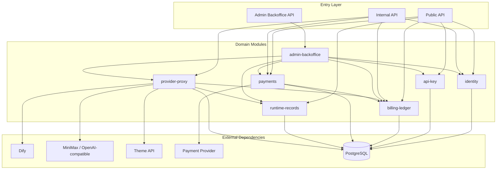

# chat_backend 模块边界与 P0 安全整改方案

日期：2026-04-15

## 1. 文档目标

这份文档用于回答三个直接问题：

1. 当前 chat_backend 应该如何拆出清晰模块边界，避免继续膨胀。
2. 这些边界在当前单仓 `xiamimate-chat-backend` 内应该如何落地，而不是停留在概念层。
3. 针对当前最危险的三个问题，P0 级安全整改应该先做什么。

本文不是“立刻拆成多个独立服务”的方案，而是先给出一版可执行的模块化单体拆分蓝图。先在同仓内建立清晰边界，再决定哪些模块值得独立部署。


## 2. 当前问题归纳

当前 `data_platform/api/chat_backend.py` 已同时承接：

- 用户身份投影与用户建档
- 用户 API Key 生成与校验
- 积分账户与积分台账
- 支付订单、订阅、发放
- Dify、MiniMax、Theme API 代理
- 会话、消息、分析运行、工件、usage event 落库
- 内部服务鉴权、幂等与轻量限流

这意味着它现在不是一个单纯的“业务 API 文件”，而是把账号边界、计费边界、支付边界、代理边界和运行记录边界全部压在一个进程和一个文件里。

当前最需要优先面对的不是“功能还少”，而是“边界太混，安全责任不清”。


## 3. 设计原则

### 3.1 先模块化单体，再决定是否拆服务

第一阶段先在当前仓库内完成目录、接口、表 ownership、调用路径的解耦，不立刻引入额外网络 hops。

### 3.2 安全边界先于代码搬家

如果 API Key 仍明文存储、用户身份仍可被 header 冒充，那么即使把代码拆成多个文件，风险依然存在。

### 3.3 账务事实只保留一份

积分余额、账本、支付订单、订阅发放必须有明确 source-of-truth，不能在 provider proxy、admin、pipeline 中各自维护一套衍生状态。

### 3.4 后台管理模块只能走正式域服务

后台管理不允许绕过领域服务直接写业务表。否则它会变成新的风险入口。


## 4. 目标模块边界

## 4.1 总体模块图



### 4.2 模块列表总表

| 模块 | 负责什么 | 不负责什么 | 建议 owner 表 | 主要调用方 |
|---|---|---|---|---|
| `identity` | 用户身份引入、用户投影、会话断言校验、内部用户 token mint/verify | API Key 生命周期、积分扣费、支付 | `app_user`，新增 `identity_session` / `identity_assertion_audit` | Public API, Admin |
| `api-key` | 用户 key 创建、展示一次、轮换、吊销、scope、key 验证 | 用户登录、积分余额写入、支付处理 | 现 `user_api_key` 重构为 `api_key`，新增 `api_key_audit` | Public API, Internal API, Admin |
| `billing-ledger` | 积分账户、定价版本、账本、usage event、扣费/退款/发放结算 | 支付网关回调签名、模型代理 | `user_credit_account`, `credit_ledger_entry`, `usage_event`, `billing_package` | Public API, Payments, Provider Proxy, Admin |
| `payments` | 订单、支付回调、订阅周期、发放编排、对账任务 | 直接维护积分账本、直接校验 API Key | `payment_order`, `billing_subscription`, `subscription_grant`, 新增 `payment_callback_event` | Public API, PSP callback, Admin |
| `provider-proxy` | 代理 Dify / LLM / Theme API，请求编排、超时、重试、审计、与账本交互 | 用户登录、订单处理、后台展示逻辑 | 新增 `provider_request_log`，必要时 `provider_error_log` | Internal API, Runtime, Admin |
| `runtime-records` | chat session、message、analysis run、artifact 的状态沉淀 | API Key 管理、支付结算 | `chat_session`, `chat_message`, `analysis_run`, `analysis_artifact` | Public API, Provider Proxy, Admin |
| `admin-backoffice` | 管理端查询与操作编排，审计后台操作 | 直接写业务表、直接代理外部 provider | 新增 `admin_operator`, `admin_audit_log` | Admin UI |


## 5. 每个模块的明确边界

### 5.1 `identity`

#### 职责

- 接收来自 Open WebUI / Pipelines 的已认证用户上下文
- 将上游身份映射或投影到 `app_user`
- 生成 chat_backend 自己可验证的短期访问断言
- 验证 public API 的用户身份
- 为 admin、support、finance、ops 等后台角色提供权限判定入口

#### 典型输入输出

- 输入：上游可信身份声明、内部服务凭证、刷新请求
- 输出：`subject_user_id`、受控 claims、短时 access token、身份审计记录

#### 不允许做的事

- 不直接从 `X-User-*` 裸 header 推断用户身份
- 不生成或返回用户 API Key
- 不直接修改积分余额

#### 建议新增接口

- `POST /internal/identity/exchange-webui-user`
- `POST /internal/identity/verify-session`
- `GET /v1/me`

#### 建议新增表

- `app.identity_session`
  - `session_token_id`
  - `user_id`
  - `issuer`
  - `audience`
  - `expires_at`
  - `revoked_at`
- `app.identity_assertion_audit`


### 5.2 `api-key`

#### 职责

- 为用户管理一个或多个 API Key
- 创建时只展示一次明文 secret
- 使用 server-side secret 生成可查询的 key 指纹或 HMAC
- 提供 key 列表、轮换、吊销、过期、scope 管理
- 提供 key 校验与 last_used_at 更新

#### 不允许做的事

- 不把明文 key 存入数据库
- 不把完整 key 作为 `GET /v1/me` 的常规响应内容
- 不直接扣减积分

#### 表模型调整建议

当前 `app.user_api_key` 需要升级成“一用户多 key”的模型，至少包含：

- `api_key_id` 主键
- `user_id`
- `key_name`
- `key_prefix`
- `key_last4`
- `key_fingerprint` 或 `key_hmac`
- `hash_version`
- `scope_json`
- `status`
- `expires_at`
- `created_at`
- `last_used_at`
- `revoked_at`
- `created_by`

建议新增：

- `app.api_key_audit`
  - create
  - reveal_once
  - rotate
  - revoke
  - verify_fail

#### 建议新增接口

- `POST /v1/me/api-keys`
- `GET /v1/me/api-keys`
- `POST /v1/me/api-keys/{api_key_id}/rotate`
- `POST /v1/me/api-keys/{api_key_id}/revoke`
- `POST /internal/api-keys/verify`


### 5.3 `billing-ledger`

#### 职责

- 管理积分账户
- 管理账本 entry
- 统一根据 pricing version 计算消费或返还
- 记录 usage event
- 处理 grant / consume / refund / reserve / commit / cancel 等资金动作

#### 不允许做的事

- 不自己接 PSP 回调
- 不直接代理模型请求
- 不持有上游 provider secret

#### 边界规则

- `payments` 只告诉它“应该发放多少积分”，不直接改余额
- `provider-proxy` 只告诉它“发生了什么 usage”，不直接写账本表
- `admin-backoffice` 只能通过显式命令接口做人工补单、调整或冲正

#### 建议新增能力

- 预扣与提交：避免长流程调用过程中先消费后失败
- 定价版本冻结：历史消费按历史规则回放
- 冲正原因码：补单、误扣、系统修复、人工授权等

#### 典型接口

- `POST /internal/billing/reserve`
- `POST /internal/billing/commit`
- `POST /internal/billing/cancel`
- `POST /internal/billing/grant`
- `POST /internal/billing/refund`


### 5.4 `payments`

#### 职责

- 创建订单
- 存储支付回调原文
- 验签、幂等、防重放
- 管理订阅周期
- 在支付确认后调用 `billing-ledger` 完成积分发放
- 提供补单、对账、失败回放任务

#### 不允许做的事

- 不直接修改 `user_credit_account`
- 不直接操作 `credit_ledger_entry`
- 不把支付成功等同于已经完成积分入账，必须走账本确认流程

#### 建议新增表

- `app.payment_callback_event`
- `app.payment_reconciliation_task`

#### 典型接口

- `POST /v1/payments/orders`
- `GET /v1/payments/orders/{order_id}`
- `POST /internal/payments/provider-callback/{provider}`
- `POST /internal/payments/reconcile/{order_id}`


### 5.5 `provider-proxy`

#### 职责

- 对外统一代理 Dify、MiniMax、Theme API
- 维护 provider timeout、retry、circuit break、error mapping
- 在请求生命周期中与 `billing-ledger` 交互
- 记录 provider request log 与 provider error log
- 将外部 provider 可观测信息收敛为内部统一事件

#### 不允许做的事

- 不校验终端用户身份
- 不自己解释支付状态
- 不直接操作订单、订阅表

#### 边界规则

- 所有 provider 调用前先拿到明确的 `actor_user_id` 和 `billing_context`
- 对 workflow 场景，优先使用 `reserve -> provider call -> commit/cancel`
- 对知识检索、theme call、LLM call 的计费策略由 `billing-ledger` 输出，不由 proxy 内部硬编码扩散

#### 建议新增表

- `app.provider_request_log`
- `app.provider_failure_log`


### 5.6 `runtime-records`

#### 职责

- 管理 chat session 与 message
- 管理 analysis run 状态机
- 沉淀 artifact
- 为 admin 与用户端提供可回放的运行记录

#### 不允许做的事

- 不扣积分
- 不校验 API Key
- 不直接调用支付网关

#### 边界规则

- `provider-proxy` 只提交状态事件，不直接散落写多张运行表
- `runtime-records` 负责 run lifecycle 的唯一状态变迁


### 5.7 `admin-backoffice`

这是新增模块，不是把现有 public API 换个皮，而是一个明确的后台运营与支持边界。

#### 核心目的

- 查看用户档案、API Key 状态、积分余额、账本、订单、订阅、运行记录
- 支持有限的人工操作，例如禁用 key、人工补单、人工加减积分、重放回调
- 做安全与运维观察，例如查看异常 provider 请求、失败回调、频繁校验失败的 key

#### 不允许做的事

- 不允许直接执行 SQL 修改核心业务表
- 不允许在没有审计记录的情况下执行账户变更
- 不允许复用终端用户接口做后台操作

#### 后台建议角色

- `admin`：系统管理员
- `support`：用户支持，可读用户、订单、运行记录
- `finance`：财务，只能看订单、订阅、账本、补单状态
- `ops`：运维，只能看 provider、回调、任务、告警

#### 首期建议页面

- 用户中心：用户主档、状态、最近活动
- API Key 管理：key 列表、状态、最近使用、吊销/轮换
- 积分账本：账户余额、最近账本、冲正原因
- 订单与订阅：订单状态、回调记录、订阅周期、发放记录
- 运行记录：session、run、artifact、失败上下文
- Provider 监控：按 provider 的错误率、超时、失败详情
- 安全台账：校验失败 key、异常 header、禁用用户、人工操作审计

#### 模块形式建议

第一阶段先做 `admin-backoffice API`，UI 可以后置，但边界必须先定义。

如果需要快速形成可视化后台，推荐路径是：

1. 本仓先提供 `/admin/*` 内部 API。
2. 后续再单独起一个 `xiamimate-admin-console` 前端项目。
3. 管理端只通过 `admin-backoffice API` 访问，不直连业务库。


## 6. 目录拆分建议

建议把当前单文件拆成下面这种仓内结构：

```text
data_platform/
  chat_backend/
    app.py
    api/
      public/
        me.py
        api_keys.py
        billing.py
        payments.py
        sessions.py
        runs.py
      internal/
        identity.py
        api_keys.py
        billing.py
        payments.py
        providers.py
        callbacks.py
      admin/
        users.py
        api_keys.py
        billing.py
        payments.py
        runs.py
        providers.py
    domains/
      identity/
        models.py
        service.py
        repository.py
        tokens.py
      api_keys/
        models.py
        service.py
        repository.py
        hashing.py
      billing/
        models.py
        service.py
        repository.py
        pricing.py
      payments/
        models.py
        service.py
        repository.py
        callbacks.py
      provider_proxy/
        service.py
        dify.py
        minimax.py
        theme_api.py
        audit.py
      runtime_records/
        models.py
        service.py
        repository.py
      admin/
        service.py
        permissions.py
        audit.py
    infra/
      postgres.py
      http.py
      settings.py
      idempotency.py
      rate_limit.py
      logging.py
```

### 6.1 拆分顺序建议

先拆 service/repository 和 routes，再决定是否独立部署。建议顺序：

1. `identity`
2. `api-key`
3. `billing-ledger`
4. `payments`
5. `provider-proxy`
6. `runtime-records`
7. `admin-backoffice`

这个顺序的原因是：前三项先解决最危险的安全与计费边界，后四项再收口运行与运营边界。


## 7. 核心调用规则

为了避免模块名拆出来、耦合还在，建议强制遵守下面几条规则：

### 7.1 用户身份只从 `identity` 出口进入

- public route 不再直接读 `X-User-*`
- 所有用户上下文都要通过 `identity` 验证结果进入业务逻辑

### 7.2 API Key 校验只从 `api-key` 出口进入

- 任何需要 key 校验的地方都不能直接查表
- 任何需要 `last_used_at` 的地方都不能直接 update 表

### 7.3 余额变动只允许 `billing-ledger` 执行

- `payments`、`provider-proxy`、`admin-backoffice` 只发命令，不直接写余额

### 7.4 支付结果不直接等于到账

- PSP callback 只改变支付状态
- 真正到账必须有 `billing-ledger grant` 成功确认

### 7.5 后台管理只走管理编排服务

- 后台 UI 不允许绕过 `admin-backoffice`
- `admin-backoffice` 不允许绕过领域 service


## 8. 推荐的部署演进路线

### Phase A：模块化单体

保留一个进程、一个仓库、一个数据库，但把目录、service、repository、route、表 ownership 先理顺。

### Phase B：分离 `provider-proxy`

当外部 provider 调用量、重试与超时策略明显复杂化时，再把 `provider-proxy` 抽成独立服务。

### Phase C：分离 `payments`

当支付渠道、签名校验、对账、补单、退款复杂度明显上升时，再把 `payments` 抽成独立服务。

### Phase D：独立后台管理端

管理 UI 形成后，把它从主产品入口中分离，挂到独立的内网或受控后台域名。


## 9. P0 安全整改清单

这里的 P0 只聚焦三件事：

1. 明文 API Key
2. 单 key 模型
3. header 信任


### 9.1 P0-1 移除明文 API Key 存储

#### 当前问题

- 数据库中存在 `api_key_raw`
- `/v1/me` 与 `/v1/me/api-key` 会返回完整 key payload

#### 目标状态

- 数据库不再保留明文 API Key
- 服务运行日志、错误日志、API 响应都不返回完整 key
- 明文 key 只在创建或轮换成功时展示一次

#### 具体动作

1. 新建 `api_key` 表结构或迁移现表，移除 `api_key_raw` 持久化路径。
2. 采用 `HMAC-SHA256(server_secret, api_key)` 生成可查询指纹，另存 `prefix` 与 `last4` 供展示。
3. 新增 `hash_version`，为后续算法升级留口。
4. 修改所有查询与响应模型，统一只返回 `api_key_id`、`key_name`、`prefix`、`last4`、`status`、`last_used_at`。
5. 修改 `GET /v1/me`，去掉完整 key 返回。
6. 修改 `GET /v1/me/api-key`，重构为 `GET /v1/me/api-keys` 列表接口。
7. 对历史明文 key 做一次迁移：
   - 读取旧值
   - 生成指纹与展示字段
   - 写入新表或新列
   - 清空旧明文字段

#### 验收标准

- 业务库内检索不到任何明文 key
- 正常 API 响应与异常响应都不包含完整 key
- 创建或轮换之外，没有任何接口可以再次取回完整 key


### 9.2 P0-2 从“一用户一把 key”改为“多 key 模型”

#### 当前问题

- 当前 key 表以 `user_id` 为主键，本质是一用户一把 key
- 无法支持分设备、分用途、分环境、轮换并行期

#### 目标状态

- 一个用户可以持有多把 key
- key 具备独立状态、用途、过期时间、scope 与审计轨迹
- 支持“创建新 key -> 切流 -> 吊销旧 key”的安全轮换流程

#### 具体动作

1. 将 key 主键切换为 `api_key_id`。
2. `user_id` 改为普通索引或外键，不再唯一。
3. 新增字段：
   - `key_name`
   - `scope_json`
   - `expires_at`
   - `created_by`
   - `revoked_at`
4. 增加每用户 active key 数量上限，初期建议 `3` 到 `5` 把。
5. 提供 list / create / rotate / revoke 接口。
6. 历史单 key 数据回填成第一把 legacy key。
7. 对不同调用场景预留 scope：
   - `theme.read`
   - `workflow.run`
   - `billing.consume`
   - `admin.readonly`

#### 验收标准

- 同一用户可并存多把 active key
- 可以单独吊销某一把 key 而不影响其他 key
- 轮换期间新旧 key 可短时间并存


### 9.3 P0-3 去掉对裸 `X-User-*` header 的信任

#### 当前问题

- public API 直接读取 `X-User-Id`、`X-User-Email`、`X-User-Name`
- 且存在 demo fallback 用户
- 这意味着只要请求能进来，就可能构造 header 冒充用户

#### 目标状态

- public API 只接受 chat_backend 可验证的身份断言
- 外部请求即使自行构造 `X-User-*` header 也不会生效
- 生产环境禁用 demo fallback

#### 推荐实现路径

推荐使用“两步法”：

1. `Pipelines/Open WebUI -> /internal/identity/exchange-webui-user`
   - 该调用必须带内部服务凭证
   - body 中携带上游已认证用户信息
2. `identity` 模块签发短期 access token
   - 后续 public API 统一走 `Authorization: Bearer <token>`

这样做的关键价值是：

- 用户 header 不再是最终信任源
- 只有受信任内部入口能把上游用户交换成 chat_backend 自己的访问断言
- 所有 public API 都改为验证签名、过期时间、audience、issuer

#### 具体动作

1. 新增 `CHAT_BACKEND_AUTH_MODE=jwt_assertion` 之类的受控配置。
2. 生产环境下移除 demo fallback。
3. public route 统一读取 bearer token，而不是 `X-User-*`。
4. 新增 token 校验逻辑：
   - `iss`
   - `aud`
   - `sub`
   - `exp`
   - `nbf`
   - `jti`
5. 对内部 exchange 接口增加：
   - service authentication
   - 重放保护
   - 审计记录
6. 对所有 external-facing route 忽略原始 `X-User-*` 头。

#### 验收标准

- 直接 curl public API 并伪造 `X-User-*` 无法通过认证
- 生产环境没有 demo 用户回落路径
- 每个用户请求都可追踪到身份断言来源


### 9.4 建议顺手一起做的 P0 邻接项

这几项虽然不在用户点名的三件事里，但与上面三项强耦合，建议同波次完成：

1. 将内部共享 `service secret` 逐步收敛为按服务分配的 machine credential。
2. 将 `charge-points` 从直接扣减改为 `reserve/commit/cancel` 结构，避免长流程失败后账本异常。
3. 对后台所有人工操作新增 `admin_audit_log`。
4. 对 API Key 校验失败、身份断言失败、内部鉴权失败建立统一安全日志。


## 10. 后台管理模块的建议定位

你提到“有必要加一个可视化的后台管理模块”，我判断这是必要的，但它不应该以“在现有 public API 上加几个管理员开关”的方式实现。

正确定位应是：

- 一个独立的 `admin-backoffice` 模块
- 一套专门的 `/admin/*` API
- 一套最小权限角色模型
- 全量操作审计

### 10.1 后台的首期目标不是“全能”，而是“可看清、可追责”

后台首期最值钱的不是炫功能，而是解决下面这些现实问题：

- 某个用户为什么被扣了积分
- 某个 key 是否被泄露或异常使用
- 某个支付订单为什么没到账
- 某次 workflow 为什么失败
- 某个 provider 最近是否大量超时

### 10.2 后台首期建议优先级

#### P0 页面

- 用户详情页
- API Key 列表与状态页
- 积分账本页
- 订单与订阅页
- 安全审计页

#### P1 页面

- Provider 请求监控页
- 运行记录与工件页
- 人工补单与冲正页

#### P2 页面

- 数据统计大盘
- 风控规则配置页
- 渠道与定价策略配置页


## 11. 推荐执行顺序

### 第一周

1. 建立新目录结构与 service/repository 边界
2. 把 `identity`、`api-key`、`billing-ledger` 从单文件中抽出
3. 改掉明文 key 与 header 信任问题

### 第二周

1. 拆出 `payments`
2. 把 `provider-proxy` 改成独立 service 层
3. 建立 `admin-backoffice API` 只读版本

### 第三周

1. 做后台最小可视化页面
2. 增加支付补单、账本冲正、key 吊销等受审计操作
3. 增加 provider 监控与失败回放能力


## 12. 一句话结论

这版 chat_backend 不应该再按“继续在一个文件里加功能”的方式演进，而应立即收敛为：

`identity + api-key + billing-ledger + payments + provider-proxy + runtime-records + admin-backoffice`

其中第一波必须先完成的不是 UI，而是三件安全基础设施：

- 去掉明文 API Key
- 升级为多 key 模型
- 去掉对裸 header 的信任

只有这三件事先做对，后续的后台管理、支付补单、计费运营才有可信基础。